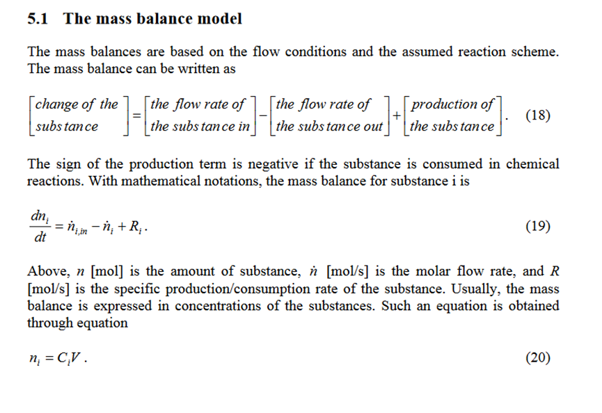
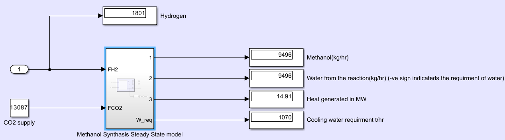

# Water Management and the energy transition

*We seek to stimulate a fast and sustainable energy transition while recognizing the critical value of water throughout the entire green hydrogen value chain.*

## Intro
Green hydrogen plays a key role in the defosillization of base chemicals and industrial production [1]. Despite the global potential for green hydrogen, affordable production using wind or solar energy is limited, mostly to regions the global south [2]. Unfortunately, clean water, as main resource for green hydrogen, is finite and often scarce in these regions [3]. To address these challenges, the use of multiple water source must be considered. The entire process chain from hydrogen to follow-up derivates is referred to as Power-to-X (PtX). The German research project [H2Mare](https://www.wasserstoff-leitprojekte.de/leitprojekte/h2mare) has the goal to cover the entire PtX value chain, with an additional focus on water as the primary resource for green hydrogen. The project addresses technical aspects of offshore hydrogen and PtX production, as well as knowledge transfer and upscaling.

## Objective
Methanol synthesis has received considerable attention and is a significant topic in future global energy discussions. Creating a sustainable and cost-effective process relies on effective process design, control, and optimization. A crucial tool in this context is having an accurate process model. The choices made regarding the carbon source and reaction kinetics significantly impact the structure of the model used. Therefore, there is ongoing research to develop a comprehensive model for methanol synthesis. 

## Goal
The interdependence of the management of water and energy is noted to date but not specifically addressed. While fresh water resources worldwide are already being overexploited, the global (green) energy transition will place additional stress on their recharge ability due to an increased application of PtX technologies. By deriviving open-access modells on various applications of the green hyrogen value-chain we want to secure a fast but water smart and sustainable energy transition. 

DECHEMA has bundeled varous aspects on the energy trasition withregard on water managemnt in the [Water-for-X](https://dechema.de/Water_for_X.html) raodmap. 

# Methanol Synthesis Modell

Input parameters: 
* initial concentrations of CO, CO2, H2, H2O, CH3OH, and inert gases 
* technical specification of the reactor (dimensions)
* catalyst mass, the operating temperature and pressure

Kinetic model included is *Vanden Bussche and Froment* based on Cu/ZnO/Al2O3 catalyst.
The preferred temperature range for this catalyst is  between 210 - 250 °C. Specific kinetic parameters are also taken from the reference paper [4]. The reactor design parameters are calibrated and optimized for the specific model conditions.

**Source**
[1] Geres, R., Kohn, A., Lenz, S. C., Ausfelder, F., Bazzanella, A., Möller, A., (2019). Future Camp Climate GmbH, DECHEMA, Roadmap Chemie 2050 auf dem Weg zu einer treibhausgasneutralen chemischen Industrie in Deutschland, ISBN: 978-3-89746-223-6
[2] The Future of Hydrogen, IEA, Technology report 2019
[3] Water Risk Institute (WRI), Aqueduct (2019). Overall water risk
[4] Outi Mäyrä, Kauko Leiviskä, Chapter 17 - Modeling in Methanol Synthesis, Elsevier, 2018, Pages 475-492, ISBN 9780444639035, https://doi.org/10.1016/B978-0-444-63903-5.00017-0, (https://www.sciencedirect.com/science/article/pii/B9780444639035000170)
